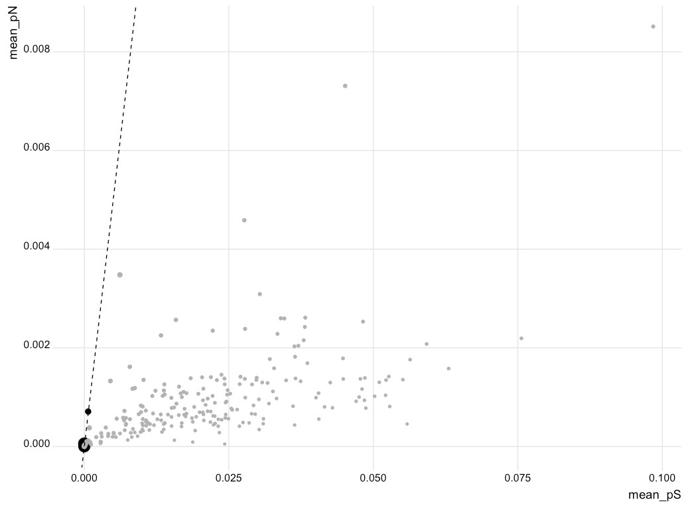

# Comparative Analysis of salmonid-related Photobacterium and its relation to phages

## Description of bioninformatics for comparative analysis of *Photobactierum*

- [Comparative Analysis of salmonid-related Photobacterium and its relation to phages](#comparative-analysis-of-salmonid-related-photobacterium-and-its-relation-to-phages)
  - [Description of bioninformatics for comparative analysis of *Photobactierum*](#description-of-bioninformatics-for-comparative-analysis-of-photobactierum)
    - [Publicly available genomes of Photobacterium](#publicly-available-genomes-of-photobacterium)
    - [Profiling of metagenomes to ERZ15233766](#profiling-of-metagenomes-to-erz15233766)
    - [Analysis of viral selection pressure ERZ15233766](#analysis-of-viral-selection-pressure-erz15233766)
    - [Some overall References](#some-overall-references)

___

### Publicly available genomes of Photobacterium
We recruited 35 publicly available metagenomes from the [Holofood project](https://www.ebi.ac.uk/ena/browser/view/PRJEB41657) from the ENA. These 35 samples were chosen because of their presence of *Photobacterium* (ERZ15233766), which can be found [here](https://www.ebi.ac.uk/ena/browser/view/ERZ15233766). A list of the accession numbers can be found in SRR_LIST.txt.

```{bash}
head -n 5 SRR_LIST.txt

ERR4918676
ERR4918736
ERR4918733
ERR4918611
ERR4918651
```

We made a script for retrieving the 35 samples from ENA, which can be used as below.
```{bash}
bash GET_HF_DATA.sh SRR_LIST.txt
```
### Profiling of metagenomes to ERZ15233766
To ensure samples were proper alligned for profiling to the *Photobacterium* genome we re-mapped the reads individually and merge the .bam files before using anvi'o.
To ensure we can use the profiles for investigation pN/pS in *Photobacterium*, we need to remember to flag `--profile-SCVs`.

The first step is to identify variants and reporting them for each sample separately. This step takes place during the profiling of a given BAM file with the program `anvi-profile`. By default, SNVs are profiled during `anvi-profile`, but SAAVs and SCVs are not. This is because it takes much longer to profile. To work with SAAVs and SCVs, ensure that your anvi-profile command has the flag `--profile-SCVs`. *This is already done in our profiling script `do_profiling.sh`*.

```{bash}
bash do_profiling.sh SRR_LIST.txt
```
___

### Analysis of viral selection pressure ERZ15233766

This analysis had heavily been influenced by amazing [tutorials](https://merenlab.org/data/anvio-structure/chapter-III/#step-14-calculating-pn-and-ps) and [comments](https://merenlab.org/2020/07/22/interacdome/) from the anvi'o [community](https://anvio.org/). Therefore, they should of course have all credits for this amazing work!

Firstly, we will need to generate a `DEFAULT` bin in a `DEFAULT` collection, since the contig database `HoloFood_ERR4918746_bin.2_Photobacterium.db` doesn't have any. 
```{bash}
anvi-script-add-default-collection -c HoloFood_ERR4918746_bin.2_Photobacterium.db \
                                   -p PROFILE.db \
                                   -C DEFAULT \
                                   -b DEFAULT
```
Now we need to run anvi-gen-variability-profile using the flag --engine CDN to get a variability-profile-txt for SCVs (single codon variants).
```{bash}
anvi-gen-variability-profile -c HoloFood_ERR4918746_bin.2_Photobacterium.db \
                                   -p PROFILE.db \
                                   -C DEFAULT \
                                   -b DEFAULT \
                                   -o variability.txt
```
The pN/pS ratio (first described in [Schloissnig et al. 2012](https://doi.org/10.1038/nature11711)) is the ratio of 2 rates: the rates of non-synonymous (pN) and synonymous (pS) polymorphism. It is analogous to dN/dS, which is the ratio of rates between non-synonymous (dN) and synonymous substitutions between 2 strains/species. We calculate pN/pS from allele frequency obtained through SCVs and SAAVs (see [Kiefl et al., 2023](https://doi.org/10.1126/sciadv.abq4632 )) for exact implementation details. We did this previously for *Mycoplasma* in Atlantic salmon, see [here](https://doi.org/10.1038/s41396-023-01379-z).

```{bash}
anvi-get-pn-ps-ratio -V variability.txt \
                     -c HoloFood_ERR4918746_bin.2_Photobacterium.db \
                     -o Photobacterium_SCVs.txt
```

Now we have our pN/pS ratio. Let make sense of them in `R`.

First we calculate the mean pN/pS per gene call across all metagenomes.

```{r pNpS analysis}
pNpS <- read_tsv("Photobacterium_SCVs.txt") %>%
  select(entry_id, sample_id, corresponding_gene_call, pN_popular_consensus, pS_popular_consensus)

pNpS.mean <- pNpS %>% group_by(corresponding_gene_call) %>%
  summarise(mean_pS = mean(pS_popular_consensus, na.rm=T),
            mean_pN = mean(pN_popular_consensus, na.rm=T),
            pNpS = mean_pN/mean_pS) %>% 
  arrange(-pNpS) %>% 
  filter_all(all_vars(!is.infinite(.))) %>%
  mutate(gene_callers_id = corresponding_gene_call) %>%
  full_join(df, by = "gene_callers_id") %>%
  na.omit()
```

We would like to look a viral genes annotated by geNomad. We look at the ratio using ggplot and tidyverse.

```{r plot pNpS, fig.width=12, fig.height=8}
pNpS.mean %>%
  mutate(color = ifelse(pNpS > 1, "black", NA)) %>%
  mutate(label = ifelse(pNpS > 1, geNomad_functions, "")) %>%
  ggplot(aes(x = mean_pS, 
             y =mean_pN, 
             size = pNpS,
             color = color,
             label = label)) + 
  geom_jitter() +
  geom_abline(intercept = 0, slope = 1, linetype = "dashed") +
  scale_size(breaks = c(1,2)) +
  ggridges::theme_ridges() +
  scale_color_manual(values=c("black"), na.value = "grey70")
  theme(legend.position = "none") +
  xlab("Mean pS") + 
  ylab("Mean pN")
```



So the dashed line indicates an abline of 1. Being on the left side of the dashed line means that pNpS > 1 and propose a selection pressure on these genes. Most genes are not under selection pressure. But I think we should zoom in a bit to make sense of those few genes. 

```{r plot pNpS zoomed, fig.width=12, fig.height=8}
pNpS.mean %>%
  mutate(Selection = ifelse(pNpS > 1, "Yes", "No")) %>%
  mutate(label = ifelse(pNpS > 1, geNomad_functions, "")) %>%
  ggplot(aes(x = mean_pS, 
             y =mean_pN, 
             size = pNpS,
             color = Selection,
             label = label)) + 
  geom_jitter() +
  geom_abline(intercept = 0, slope = 1, linetype = "dashed") +
  ggrepel::geom_text_repel(max.overlaps = 150) + 
  scale_size(breaks = c(1,5)) +
  ggridges::theme_ridges() +
  theme(legend.position = "none") +
  xlab("Mean pS") + 
  ylab("Mean pN") + 
  xlim(0,0.0001) +
  ylim(0,0.0001) +
  scale_fill_manual(values = c(wes_palette("Rushmore1", 5))[5:4]) +
  scale_color_manual(values = c(wes_palette("Rushmore1", 5))[5:4])
```


Here we clearly see that genes under selection has viral annotations, which could indicate that the phages affect the salmonid-related *Photobacteirum*.


___

### Some overall References

**1.**  Evan Kiefl et al. ,Structure-informed microbial population genetics elucidate selective pressures that shape protein evolution.Sci. Adv.9,eabq4632(2023). https://doi.org/10.1126/sciadv.abq4632 

**2.** 	Eren, A.M., Kiefl, E., Shaiber, A. et al. Community-led, integrated, reproducible multi-omics with anvi’o. Nat Microbiol 6, 3–6 (2021). https://doi.org/10.1038/s41564-020-00834-3

**3.** 	Eren AM, Esen ÖC, Quince C, Vineis JH, Morrison HG, Sogin ML, Delmont TO. 2015. Anvi’o: an advanced analysis and visualization platform for ‘omics data. PeerJ 3:e1319 https://doi.org/10.7717/peerj.1319

**4.**  Rasmussen, J.A., Kiilerich, P., Madhun, A.S. et al. Co-diversification of an intestinal Mycoplasma and its salmonid host. ISME J 17, 682–692 (2023). https://doi.org/10.1038/s41396-023-01379-z

**5.** Schloissnig, S., Arumugam, M., Sunagawa, S. et al. Genomic variation landscape of the human gut microbiome. Nature 493, 45–50 (2013). https://doi.org/10.1038/nature11711