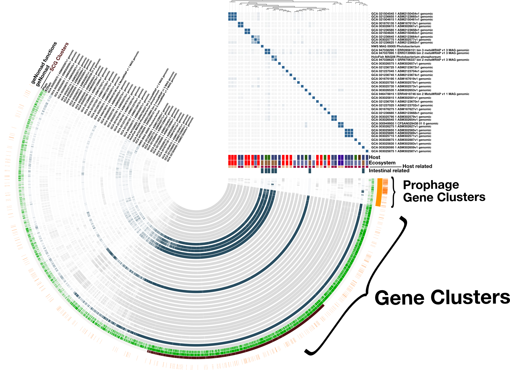
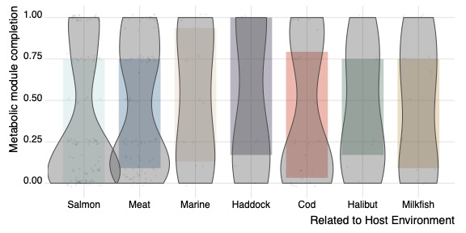

# Comparative Analysis of salmonid-related Photobacterium and its relation to phages

## Description of bioninformatics
- [Retrival of data](#publicly-available-genomes-of-Photobacterium)
- [Photobacterium phylogenomics](#Phylogenomic-Photobacterium-genomes)
- [Photobacterium comparative genomics](#Comparative-genomics-of-Photobacterium-genomes)
    - [Viral annotation for pangenome](#Viral-annotation-of-salmonid-related-*Photobacterium*)
- [Metabolic reconstruction of pangenome](Metabolic-reconstruction-of-Photobacterium)
- [Enrichment analysis of KOfams ](#Enrichment-analysis-of-KOfams)
- [Analysis of microbial metabolic independence](#analysis-of-microbial-metabolic-independence)

___

### Publicly available genomes of Photobacterium
We recruited all publicly available genomes with the bacterial genera Photobacterium from the National Center for Biotechnology Information (NCBI), using the command line-based NCBI Datasets, resulting in 361 publicly available Photobacterium genomes. Furthermore, were metagenomic assembled genomes from recent [investigation](https://www.biorxiv.org/content/10.1101/2023.07.20.549827v1).

```{bash}
# Set the search term to "Photobacterium[Organism]"
search_term="Photobacterium[Organism]"

# Use the datasets command to search for genomes matching the search term
datasets search genome "$search_term" --output-file genome_summary.json

# Use the datasets command to download the genomes in FASTA format
datasets download genome --input-file genome_summary.json --exclude-rna --exclude-protein

# Extract the downloaded files to a directory
mkdir photobacterium_genomes
unzip "*.fasta.zip" -d photobacterium_genomes

# Clean up the downloaded zip files
rm *.fasta.zip
```
___

### Phylogenomic Photobacterium genomes
All genomes were compared with salmonid-related MAGs using anvi’o/v7.1 [1,2] for phylogenomic and comparative analysis. The phylogenomic analysis was carried out based on bacterial single-copy core genes (SCGs) using an anvi’o bacterial database with 71 bacterial SCGs. Amino acid sequences were extracted from Hidden Markov Models (HMMs) of SCGs and concatenated into aligned amino acid sequences. Concatenated amino acid sequences were used to generate a Newick-based maximum-likelihood phylogeny using FastTree2 [3].

So lets start making a anvi'o database for each genome and annotate with HMMs and functional annotations, like **COG**, **KEGG**, and **PFAM**.

```{bash}
THREADS=4
for i in `ls *fa | awk 'BEGIN{FS=".fa"}{print $1}'`
do
    anvi-gen-contigs-database -f $i.fa -o $i.db -T $THREADS
    anvi-run-hmms -c $i.db
    anvi-run-ncbi-cogs -c $i.db
    anvi-run-kegg-kofams -c $i.db
    anvi-run-pfams -c $i.db
done
```
Now that we have the anvi'o databases, lets do some bash-hacking and make the external-genomes.txt file, which are needed for the smooth anvi'o.

```{bash}
# Create an empty file
> external-genomes.txt

# Loop through all .db files in the current directory
for i in *.fa; do
  # Extract filename without extension
  filename=$(basename "$i" .db)
  # Get absolute path of the file
  path=$(realpath "$i")
  # Append filename and path to external-genomes.txt
  echo -e "$filename\t$path" >> external-genomes.txt
done
```

Now we generate a concatenated fasta-file with protein calls from our HMMs. We use all genes in the Bacterial Single-copy core gene (SCGs) database and make a FastTree based on the concatenated fasta file.

```{bash}
anvi-get-sequences-for-hmm-hits --external-genomes external-genomes.txt \
                                -o concatenated-proteins.fa \
                                --hmm-source Bacteria_71 \
                                --return-best-hit \
                                --get-aa-sequences \
                                --concatenate

anvi-gen-phylogenomic-tree -f concatenated-proteins.fa \
                           -o phylogenomic-tree.txt                                
```     
___

### Comparative genomics of Photobacterium genomes

We selected the genomes, which were closely related with salmonid-related *Photobacterium* and further generate comparative genomics and annotation of progphages and phage-related genes within in the clade of salmonid-related *Photobacterium*.

```
mkdir PANGENOME
cp pangenome_genomes.fixed.fa PANGENOME/
cd PANGENOME
```

#### Viral annotation of salmonid-related *Photobacterium*
We carried out the viral annotation of salmonid-related *Photobacterium* using the novel and promising tool, [geNomad](https://github.com/apcamargo/genomad). Reference can be found [here](https://www.nature.com/articles/s41587-023-01953-y)! 

So initially we start with geNomad annotation. 
```
for file in `ls *.fixed.fa | awk 'BEGIN{FS=".db"}{print $1}'`
    do
    genomad end-to-end --cleanup "$i".fixed.fa "$i"_genomad $DB/genomad_db_v1.3
done
```

Now we need to reformat the geNomad output to anvi'o style, since we would like to import the geNomad functional annotation into each anvi'o database, so that we can inspect viral gene cluster in the pangenome. 

First thing is to export the gene call generated by prodigal during the DB generation.
```
for file in `ls *.db | awk 'BEGIN{FS=".db"}{print $1}'`
do
    anvi-export-gene-calls -c "$file".db \
                       -o "$file"_gene_calls.txt
```

Now we need to launch a small home-knitted bash script to reformat geNomad output for anvi'o gene calls, by going through positive geNomad hits in each contig and match it to the gene calls from anvi'o. 

```
for file in `ls *.db | awk 'BEGIN{FS=".db"}{print $1}'`
do
    bash geNomad_genes_2_anvio.sh $file
    bash geNomad_prophages_2_anvio.sh $file
done
```

The output file `geNomad_functions_"$file"` should look something like this. Yeah, at the moment we overwrite geNomad `e_value` with 0.

| gene_callers_id | source              | accession             | function                                        | e_value |
|----------------|---------------------|-----------------------|------------------------------------------------|---------|
| 1              | geNomad_functions   | GENOMAD.133679.CP   | ABC-type Na+ efflux pump, permease component | 0       |
| 73             | geNomad_functions   | GENOMAD.223887.VP   | NA                                             | 0       |
| 113            | geNomad_functions   | GENOMAD.160598.VC   | RNA ligase, T4 RnlA family                     | 0       |
| 152            | geNomad_functions   | GENOMAD.026404.VV   | DNA gyrase, A subunit                          | 0       |
| 155            | geNomad_functions   | GENOMAD.029837.VV   | DnaA regulatory inactivator Hda                | 0       |

Now lets import the geNomad information from above to our anvi'o databases.

```
for file in `ls *.db | awk 'BEGIN{FS=".db"}{print $1}'`
do
    echo "importing phage info from geNomad to: "$file""
    anvi-import-functions -c "$file".db -i geNomad_functions_"$file"
    anvi-import-functions -c "$file".db -i geNomad_prophage_"$file"
done
```

The comparative analysis was carried out as in the previous studies [4,5], where similarities of each amino acid sequence in every genome were calculated against every other amino acid sequence across all genomes using BLASTp. We implemented Minbit heuristics of 0.5 to eliminate weak matches between two amino acid sequences [6] and an MCL inflation of 2. We used the MCL algorithms to identify gene clusters in amino acid sequence similarity [7]. We calculated ANI using PyANI [8]. Euclidean distance and ward linkage were used to organise gene clusters and genomes. A summary of the pan-genome generated for this study is available [here]().

We selected the genomes, which were closely related with salmonid-related *Photobacterium*. Below you find the basal code for generating the *Photobacterium* pangenome.

```
# Generating genome database for pangenome
anvi-gen-genomes-storage -e external-genomes.txt \
                         -o PHOTOBACTERIUM-GENOMES.db

# Generating gene clusters and pan-profile
anvi-pan-genome -g PHOTOBACTERIUM-GENOMES.db \
                        -n PHOTOBACTERIUM \
                        --mcl-inflation 10 \
                        --minbit 0.5 \
                        --num-threads 10

# Calculating ANI across genomes
anvi-compute-genome-similarity -i external-genomes.txt -o ANI --program 'pyANI'

# adding genome-info to pangenome
anvi-import-misc-data view.txt \
                              -p PHOTOBACTERIUM_PAN/PHOTOBACTERIUM_PAN-PAN.db \
                              --target-data-table layers --just-do-it
```

After a bit of polishing and yay! 



___

### Metabolic reconstruction of Photobacterium
Metabolic reconstruction of compared MAGs was based on KOfams and was carried out using the anvi’o platform. We calculated the level of completeness for a given KEGG module [9,10] in our genomes using the programme anvi-estimate-metabolism, which leveraged the previous annotation of genes with KEGG orthologs (KOs). The URL https://merenlab.org/m/anvi-estimate-metabolism serves as a tutorial for this program which details the modes of usage and output file formats. The Heatmap of completion scores was illustrated using the ComplexHeatmap [11] package for R. Genomes were clustered based on similarity across the completion of pathways, as previously done for other bacterial genera [4]. Further illustrations was made with tidyverse and ggplot.

```{bash}
anvi-estimate-metabolism \
        -e external-genomes.txt \
        --matrix-format
```


### Enrichment analysis of KOfams 
The statistical approach for enrichment analysis is previously defined [12]. Briefly, the programme anvi-compute-functional-enrichment determined enrichment scores for KOfams genomes of salmonid-related Photobacterium and non-salmonid-related Photobacterium by fitting a binomial generalised linear model (GLM) to the occurrence of each KOfam in each group and then computing a Rao test statistic. We considered any KOfam with a q-value less than 0.05 to be ‘enriched’ in its associated group. The volcano plot was visualised using the EnhancedVolcano package for R.

We calculated the enrichment across geNomad_functions, KEGG and PFAM and for being related to a host or potentially freeliving. 
```
anvi-compute-functional-enrichment-in-pan -p PHOTOBACTERIUM/Photobacterium-PAN.db \
    -g PHOTOBACTERIUM-GENOMES.db \
    --category Host_related \
    --annotation-source geNomad_functions \
        -o enriched-functions-geNomad_Host_related.txt

anvi-compute-functional-enrichment-in-pan -p PHOTOBACTERIUM/Photobacterium-PAN.db \
    -g PHOTOBACTERIUM-GENOMES.db \
    --category Host_related \
    --annotation-source KOfam \
        -o enriched-functions-KOfam_Host_related.txt

anvi-compute-functional-enrichment-in-pan -p PHOTOBACTERIUM/Photobacterium-PAN.db \
    -g PHOTOBACTERIUM-GENOMES.db \
    --category Host_related \
    --annotation-source Pfam \
        -o enriched-functions-Pfam_Host_related.txt
```

...and also test if there were genes with a intestinal relation.
```
anvi-compute-functional-enrichment-in-pan -p PHOTOBACTERIUM/Photobacterium-PAN.db \
    -g PHOTOBACTERIUM-GENOMES.db \
    --category Intestinal_related \
    --annotation-source geNomad_functions \
        -o enriched-functions-geNomad_Intestinal_related.txt

anvi-compute-functional-enrichment-in-pan -p PHOTOBACTERIUM/Photobacterium-PAN.db \
    -g PHOTOBACTERIUM-GENOMES.db \
    --category Intestinal_related \
    --annotation-source KOfam \
        -o enriched-functions-KOfam_Intestinal_related.txt

anvi-compute-functional-enrichment-in-pan -p PHOTOBACTERIUM/Photobacterium-PAN.db \
    -g PHOTOBACTERIUM-GENOMES.db \
    --category Intestinal_related \
    --annotation-source Pfam \
        -o enriched-functions-Pfam_Intestinal_related.txt
```

### Analysis of microbial metabolic independence
To investigate whether or not these *Photobacterium* genomes are host-related we calculate their metabolic independence. Metabolic independence is a great lead to host-dependence, as this is potential directed from genome erosion, which is a clear signal host-dependence. 

Lets start with loading data (in R)
```{r load data, include=FALSE}
module_completion <- read.table(file='kegg-metabolism-module_pathwise_completeness-MATRIX.txt', header = TRUE, sep = "\t")
external_genomes <- read.table(file='view.txt', header = TRUE, sep = "\t")
enrichment <- read.table(file = "../Enrichment_Analysis/enriched-functions-KEGGModule_Host_related.txt", header = TRUE, sep = "\t")

tax <- read.table(file='view.txt', header = TRUE, sep = "\t") %>%
  mutate(ID = paste(1:nrow(.), Organism_Name, sep = "_")) %>%
  column_to_rownames(var = "ID")
```

```{r data fiddle , include=FALSE}
# turn the boring matrix format into a data frame
df <- melt(module_completion)

# set some meaningful column names
colnames(df) <- c('module', 'genome', 'completion')

# use the external genomes file to associate each genome with a 'group'
df$group <- external_genomes$Host[match(df$genome, external_genomes$samples)]
```

Lets find some **more** interesting modules. 
```{r find modules of interest}
modules_of_interest <- enrichment %>%
  dplyr::filter(enrichment_score > 1) %>%
  dplyr::select(accession,KEGG_Module)
```

Lets plot completion for modules of interest (based on enrichment related to host relation). 

```{r plot module completetion for CORE microbes}
set.seed(1)
# set explicit group orders, and assign some group colors
groups_order <- c("Salmon","Meat","Marine","Haddock","Cod","Halibut","Milkfish" )
group_colors <- c(wes_palette("Rushmore1",5)[5:3],wes_palette("Darjeeling2",4))

df <- df[df$module %in% modules_of_interest$accession, ]

ggplot(data=df, aes(x=group, y=completion, group=group)) +
  geom_boxplot(aes(fill=group), alpha=0.35, outlier.shape = NA, color=NA) +
  geom_violin(fill="#505050", alpha=0.35, width=1.3, colour = '#505050') +
  geom_jitter(colour='#222222', width = 0.3, height = 0.02, size=0.5, alpha=0.05) +
  theme_ridges() +
  theme(legend.position="none") +
  ylab("Metabolic module completion") +
  xlab("Related to Host Environment") +
  scale_x_discrete(limits = groups_order) +
  scale_fill_manual(values = group_colors)
```



So at least for module of interest, there might be some reduction in module completion and therefore a higher metabolic dependence. 

### Some overall References
**1.** 	Eren AM, Kiefl E, Shaiber A, Veseli I, Miller SE, Schechter MS, et al. Community-led, integrated, reproducible multi-omics with anvi’o. Nat Microbiol. 2021;6: 3–6.

**2.** 	Murat Eren A, Esen ÖC, Quince C, Vineis JH, Morrison HG, Sogin ML, et al. Anvi’o: an advanced analysis and visualization platform for ‘omics data. PeerJ. 2015;3: e1319.

**3.** 	Price MN, Dehal PS, Arkin AP. FastTree 2--approximately maximum-likelihood trees for large alignments. PLoS One. 2010;5: e9490.

**4.** 	Rasmussen JA, Kiilerich P, Madhun AS, Waagbø R, Lock E-JR, Madsen L, et al. Co-diversification of an intestinal Mycoplasma and its salmonid host. ISME J. 2023. doi:10.1038/s41396-023-01379-z

**5.**  Rasmussen JA, Villumsen KR, Duchêne DA, Puetz LC, Delmont TO, Sveier H, et al. Genome-resolved metagenomics suggests a mutualistic relationship between Mycoplasma and salmonid hosts. Commun Biol. 2021;4: 579.

**6.** 	Benedict MN, Henriksen JR, Metcalf WW, Whitaker RJ, Price ND. ITEP: an integrated toolkit for exploration of microbial pan-genomes. BMC Genomics. 2014;15: 8.

**7.** 	van Dongen S, Abreu-Goodger C. Using MCL to extract clusters from networks. Methods Mol Biol. 2012;804: 281–295.

**8.** 	Pritchard L, Glover RH, Humphris S, Elphinstone JG, Toth IK. Genomics and taxonomy in diagnostics for food security: soft-rotting enterobacterial plant pathogens. Anal Methods. 2015;8: 12–24.

**9.** 	Kanehisa M, Goto S, Sato Y, Kawashima M, Furumichi M, Tanabe M. Data, information, knowledge and principle: back to metabolism in KEGG. Nucleic Acids Res. 2014;42: D199–205.

**10.** 	Kanehisa M, Furumichi M, Tanabe M, Sato Y, Morishima K. KEGG: new perspectives on genomes, pathways, diseases and drugs. Nucleic Acids Res. 2017;45: D353–D361.

**11.** 	Gu Z, Eils R, Schlesner M. Complex heatmaps reveal patterns and correlations in multidimensional genomic data. Bioinformatics. 2016;32: 2847–2849.

**12.** 	Shaiber A, Willis AD, Delmont TO, Roux S, Chen L-X, Schmid AC, et al. Functional and genetic markers of niche partitioning among enigmatic members of the human oral microbiome. Genome Biol. 2020;21: 292.